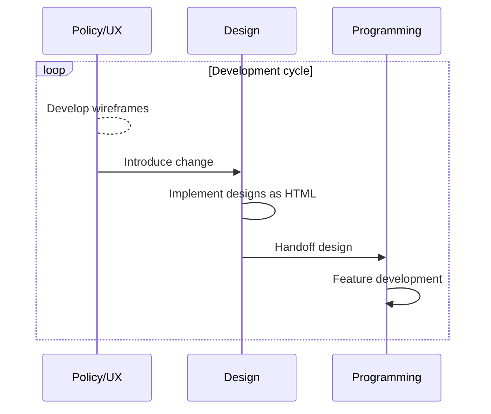
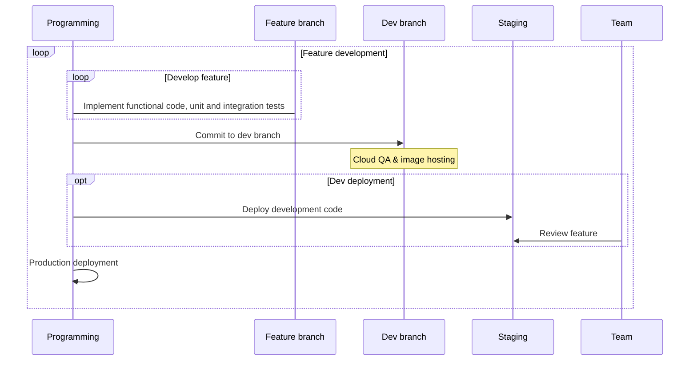
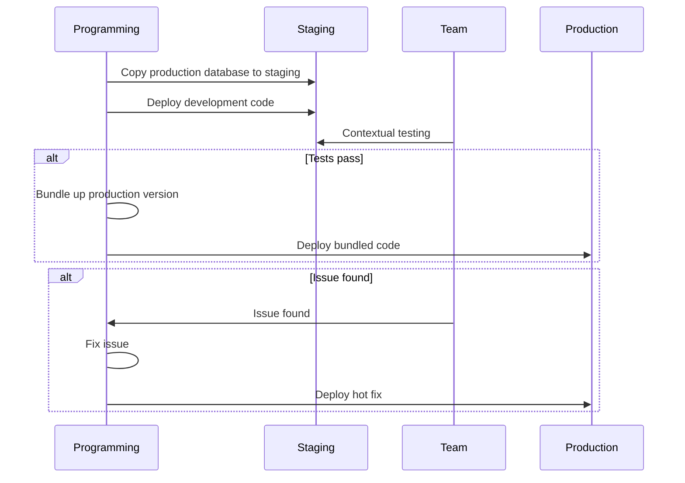
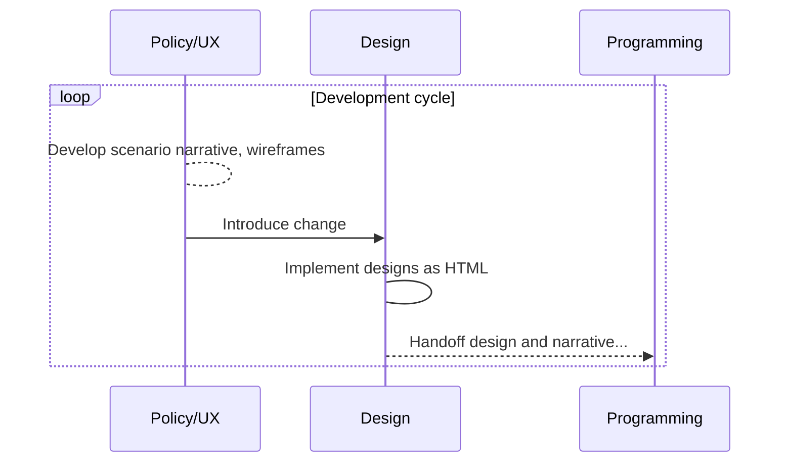
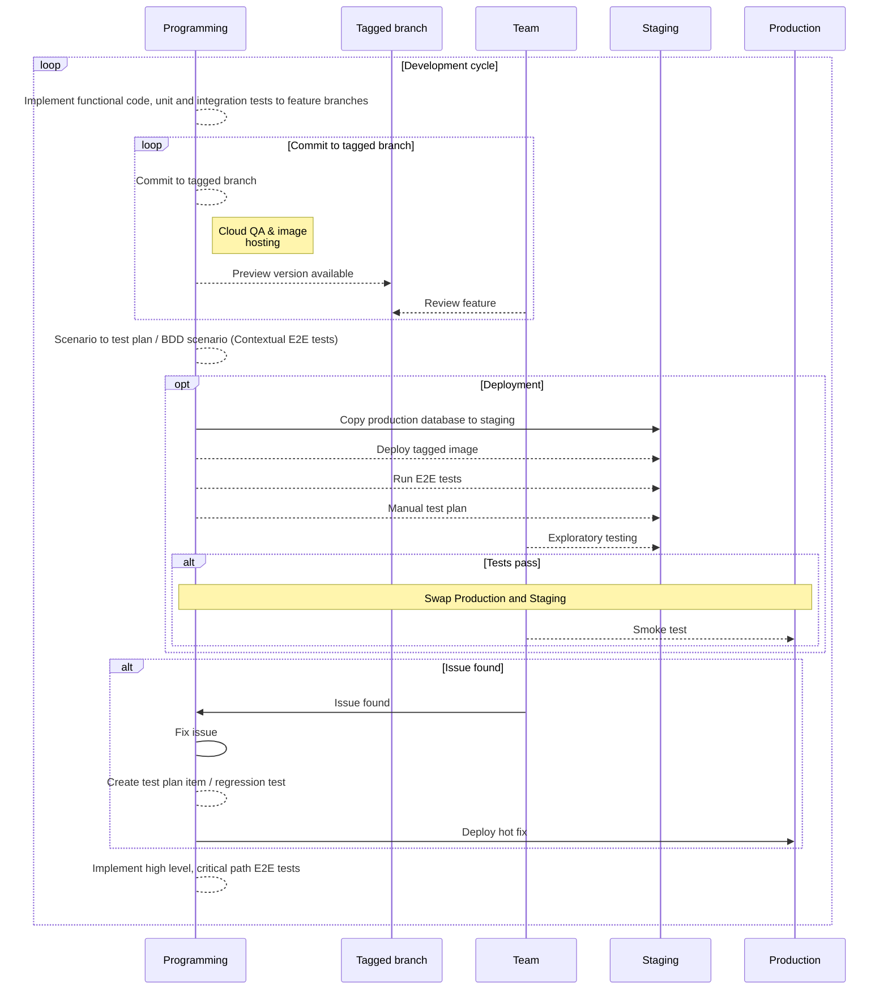

# Development process, QA, deployment

March 11, 2019 by David Mason, Talent Cloud

# Current process?

## Feature development



## Production deployment


# Types of tests

## Unit, Integration
Automated tests, run during development and on commit to significant branch

## E2E
Automated, point at any deployed instance

## Regression tests
Created in response to an issue, prevent repeats of that issue

## Contextual
Changes with known area to focus

## Test Plan
Prose for human execution (and automatable) from browser.

### Smoke test
In browser via automation / manual. 
Is this thing on?

### Critical path
In browser via automation / manual. 
Can login, create account, etc.

### Comprehensive
In browser via automation / manual.
Every nook and cranny, by section.

## Exploratory
User-driven in browser.
What if I press this button at midnight?
What if I have this extension installed?

## UI tests
In browser. 
This pixel should be next to this pixel when I press that button at midnight. 
If the screen is narrow, it should be on top of it.

## Proposal: BDD Tests
Prose tests written from the user perspective. 
Consolidates agreed on functionality and makes sense to all team members. 

Given-Then-When supports automation to reduce time required for tedious activities. 
As BDD suite is developed, reusable stanzas cover more general functionality without extra development. 


```
Scenario: Available jobs display time remaining

Given I am not logged in
When I go to the jobs available page
Then I should see all available jobs
And each should have an Apply By date
And it should be after now
And it should have time remaining

```
BDD tests generally require more effort and are more brittle, but they can save hours of critical manual testing and are executable confirmation of the product features on the actual site.

```
  Scenario: Protected A combinations
    Given the job department and position choice
      | Via Rail Canada | Manager |
      | Bank of Canada Museum | Staff |
      | Agriculture and Agri-Food Canada | Staff |
      …
    Then the classification should be Protected A

  Scenario: Protected B combinations
    Given the job department and position choice
      | Bank of Canada Museum | Manager |
      | Treasury Secretariat Board | Staff |
      | Treasury Secretariat Board | Manager |
      | Bank of Canada | Staff |
      | Bank of Canada | Manager |
      | Department of National Defense | Staff |
      | Department of National Defense | Manager |
      …
    Then the classification should be Protected B
```


# Proposed deployment 
Dotted lines: new or changed






# How to get there?
* Everyone commits to process
* Phase in components starting with test plan
* Implementation choices
* Everyone is involved, but process cop(s) are helpful
* It must be easy to capture and incorporate incidental regression tests found by any team member

References:

1. https://martinfowler.com/articles/practical-test-pyramid.html
1. https://www.quora.com/Can-a-product-owner-use-Behavior-Driven-Development-BDD-behavioral-syntax-to-plan-an-iteration-before-its-development
